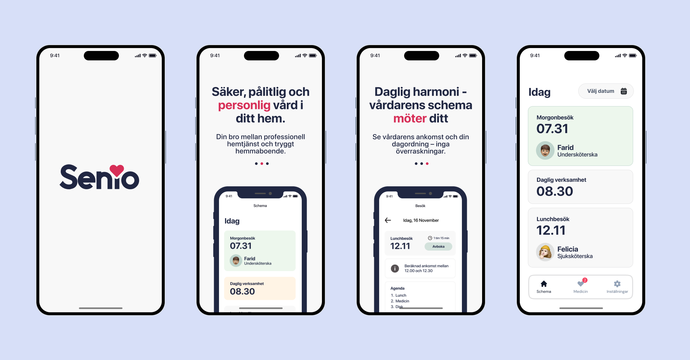
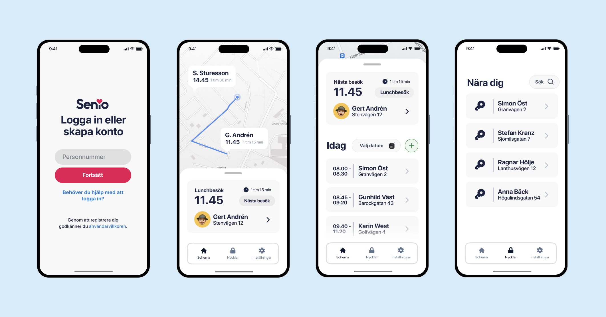

Welcome to my digital portfolio showcasing my work in UX/UI design, 3D animation, and 2D animation. Here, you'll find a selection of projects that demonstrate my skills and approach to digital arts and design.

## UX/UI Design

In this section, explore various UX/UI design projects where I focus on enhancing user experience through intuitive interface design and thoughtful user interactions.

  
**Project Title 1: Digitalizing Home Care for the Elderly**  
This project was aimed at improving existing market solutions for digitalizing home care services for the elderly, which were often outdated and had cumbersome user experiences. Conducted at Chalmers, I was solely responsible for the UX and UI design, focusing on modernizing the interface and workflow to reduce the day-to-day tedium for home care workers. My approach prioritized making information easily accessible and organizing it according to an intuitive hierarchy, ensuring that caregivers could focus more on care and less on navigating the software.

  
**Project Title 2**: Insight into the project's scope and your specific contributions.

## 3D Animation

My 3D animation projects highlight my capability in character animation, environmental modeling, and visual storytelling.

  
**Animation Title 1**: Overview of the animation project and any notable techniques used.

  
**Animation Title 2**: Description of the animation's theme and what it aims to convey.

## 2D Animation

Discover my 2D animation work where I bring stories to life through frame-by-frame animation and compelling motion graphics.

**Animation Title 1**: Explanation of the animation process and the story behind it.

  
**Animation Title 2**: Details on the creative process and the technologies used.

## Contact Information

For more information or to discuss potential projects, please reach out via:
- **Email**: [your-email@example.com](mailto:carl_andren@outlook.com)
- **LinkedIn**: [LinkedIn profile](https://www.linkedin.com/in/carl-andr%C3%A9n-617b811b0/)

Thank you for visiting my portfolio!
